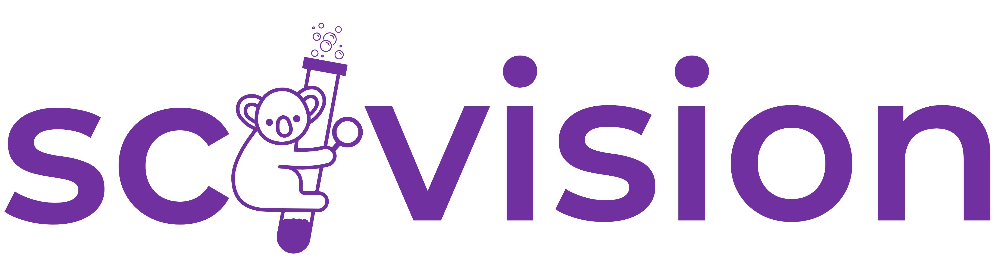

# A toolkit for scientific image analysis
 

    
    
    
    
    
    
     

<!-- ALL-CONTRIBUTORS-BADGE:START - Do not remove or modify this section -->

<!-- ALL-CONTRIBUTORS-BADGE:END -->

This repository is where the development is hosted for the [Scivision Webapp](https://alan-turing-institute.github.io/scivision/) (our main project website) and [Scivision Python package](https://pypi.org/project/scivision/).

Here you can open an [issue to report bugs or request features](https://github.com/alan-turing-institute/scivision/issues), ask questions or [start a discussion about the project](https://github.com/alan-turing-institute/scivision/discussions) or contribute to the codebase.

If you are new to Scivision, start by visiting our main [project website](https://alan-turing-institute.github.io/scivision/).

## ⬇️ Installation

Check out the [installation instructions](https://scivision.readthedocs.io/en/latest/user_guide.html#installation) on our readthedocs site, which also includes a [support table](https://scivision.readthedocs.io/en/latest/user_guide.html#support-table) for matching Python and Scivision versions.

## 🤔 Contributing

See the [Contributing Guide on readthedocs](https://scivision.readthedocs.io/en/latest/contributing.html), which contains information on how to set up and contribute computer vision models and scientific image datasets to the scivision catalog, and make them available via the scivision python API, as well as modify the source code.

You may consider starting or joining in with a [discussion](https://github.com/alan-turing-institute/scivision/discussions), or opening an [issue](https://github.com/alan-turing-institute/scivision/issues) in this GitHub repo.

## Contributors ✨

Thanks goes to these wonderful people ([emoji key](https://allcontributors.org/docs/en/emoji-key)):

<!-- ALL-CONTRIBUTORS-LIST:START - Do not remove or modify this section -->
<!-- prettier-ignore-start -->
<!-- markdownlint-disable -->
<table>
  <tbody>
    <tr>
      <td align="center" valign="top" width="14.28%"><a href="https://github.com/AidaMehonic"> <b>Aida Mehonic</b></a> <a href="#eventOrganizing-AidaMehonic" title="Event Organizing">📋</a> <a href="https://github.com/alan-turing-institute/scivision/commits?author=AidaMehonic" title="Documentation">📖</a> <a href="#ideas-AidaMehonic" title="Ideas, Planning, & Feedback">🤔</a></td>
      <td align="center" valign="top" width="14.28%"><a href="http://lowe.cs.ucl.ac.uk"> <b>Alan R Lowe</b></a> <a href="https://github.com/alan-turing-institute/scivision/commits?author=quantumjot" title="Code">💻</a> <a href="#ideas-quantumjot" title="Ideas, Planning, & Feedback">🤔</a> <a href="https://github.com/alan-turing-institute/scivision/commits?author=quantumjot" title="Documentation">📖</a> <a href="#infra-quantumjot" title="Infrastructure (Hosting, Build-Tools, etc)">🚇</a> <a href="#fundingFinding-quantumjot" title="Funding Finding">🔍</a></td>
      <td align="center" valign="top" width="14.28%"><a href="https://github.com/acocac"> <b>Alejandro ©</b></a> <a href="https://github.com/alan-turing-institute/scivision/commits?author=acocac" title="Code">💻</a> <a href="#ideas-acocac" title="Ideas, Planning, & Feedback">🤔</a> <a href="#design-acocac" title="Design">🎨</a> <a href="#example-acocac" title="Examples">💡</a></td>
      <td align="center" valign="top" width="14.28%"><a href="https://github.com/mooniean"> <b>Beatriz Costa Gomes</b></a> <a href="https://github.com/alan-turing-institute/scivision/commits?author=mooniean" title="Code">💻</a> <a href="#ideas-mooniean" title="Ideas, Planning, & Feedback">🤔</a> <a href="https://github.com/alan-turing-institute/scivision/commits?author=mooniean" title="Documentation">📖</a> <a href="#design-mooniean" title="Design">🎨</a> <a href="#example-mooniean" title="Examples">💡</a></td>
      <td align="center" valign="top" width="14.28%"><a href="https://github.com/lupinthief"> <b>Ben Evans</b></a> <a href="#ideas-lupinthief" title="Ideas, Planning, & Feedback">🤔</a></td>
      <td align="center" valign="top" width="14.28%"><a href="http://edchalstrey.com/"> <b>Ed Chalstrey</b></a> <a href="https://github.com/alan-turing-institute/scivision/commits?author=edwardchalstrey1" title="Code">💻</a> <a href="#ideas-edwardchalstrey1" title="Ideas, Planning, & Feedback">🤔</a> <a href="https://github.com/alan-turing-institute/scivision/commits?author=edwardchalstrey1" title="Documentation">📖</a> <a href="#infra-edwardchalstrey1" title="Infrastructure (Hosting, Build-Tools, etc)">🚇</a></td>
      <td align="center" valign="top" width="14.28%"><a href="https://erioldoesdesign.github.io/"> <b>Eriol Fox</b></a> <a href="#ideas-Erioldoesdesign" title="Ideas, Planning, & Feedback">🤔</a> <a href="#design-Erioldoesdesign" title="Design">🎨</a></td>
    </tr>
    <tr>
      <td align="center" valign="top" width="14.28%"><a href="https://github.com/evangeline-corcoran"> <b>Evangeline Corcoran</b></a> <a href="https://github.com/alan-turing-institute/scivision/commits?author=evangeline-corcoran" title="Code">💻</a> <a href="#ideas-evangeline-corcoran" title="Ideas, Planning, & Feedback">🤔</a> <a href="https://github.com/alan-turing-institute/scivision/commits?author=evangeline-corcoran" title="Documentation">📖</a> <a href="#infra-evangeline-corcoran" title="Infrastructure (Hosting, Build-Tools, etc)">🚇</a></td>
      <td align="center" valign="top" width="14.28%"><a href="https://github.com/IFenton"> <b>Isabel Fenton</b></a> <a href="https://github.com/alan-turing-institute/scivision/commits?author=IFenton" title="Code">💻</a> <a href="#ideas-IFenton" title="Ideas, Planning, & Feedback">🤔</a> <a href="https://github.com/alan-turing-institute/scivision/commits?author=IFenton" title="Documentation">📖</a> <a href="#infra-IFenton" title="Infrastructure (Hosting, Build-Tools, etc)">🚇</a></td>
      <td align="center" valign="top" width="14.28%"><a href="https://github.com/jmp1985"> <b>James Parkhurst</b></a> <a href="#ideas-jmp1985" title="Ideas, Planning, & Feedback">🤔</a> <a href="#data-jmp1985" title="Data">🔣</a> <a href="#plugin-jmp1985" title="Plugin/utility libraries">🔌</a></td>
      <td align="center" valign="top" width="14.28%"><a href="https://github.com/JamesAliScott"> <b>JamesAliScott</b></a> <a href="#ideas-JamesAliScott" title="Ideas, Planning, & Feedback">🤔</a> <a href="#data-JamesAliScott" title="Data">🔣</a></td>
      <td align="center" valign="top" width="14.28%"><a href="https://github.com/kasra-hosseini"> <b>Kasra Hosseini</b></a> <a href="https://github.com/alan-turing-institute/scivision/commits?author=kasra-hosseini" title="Code">💻</a> <a href="#ideas-kasra-hosseini" title="Ideas, Planning, & Feedback">🤔</a> <a href="https://github.com/alan-turing-institute/scivision/commits?author=kasra-hosseini" title="Documentation">📖</a> <a href="#infra-kasra-hosseini" title="Infrastructure (Hosting, Build-Tools, etc)">🚇</a></td>
      <td align="center" valign="top" width="14.28%"><a href="https://github.com/MartinSJRogers"> <b>Martin Rogers</b></a> <a href="#data-martinsjrogers" title="Data">🔣</a> <a href="#example-martinsjrogers" title="Examples">💡</a> <a href="https://github.com/alan-turing-institute/scivision/commits?author=martinsjrogers" title="Code">💻</a> <a href="#ideas-martinsjrogers" title="Ideas, Planning, & Feedback">🤔</a></td>
      <td align="center" valign="top" width="14.28%"><a href="https://miquelmassot.github.io/"> <b>Miquel Massot</b></a> <a href="https://github.com/alan-turing-institute/scivision/commits?author=miquelmassot" title="Code">💻</a> <a href="#ideas-miquelmassot" title="Ideas, Planning, & Feedback">🤔</a> <a href="https://github.com/alan-turing-institute/scivision/commits?author=miquelmassot" title="Documentation">📖</a> <a href="#plugin-miquelmassot" title="Plugin/utility libraries">🔌</a></td>
    </tr>
    <tr>
      <td align="center" valign="top" width="14.28%"><a href="http://www.robblackwell.com"> <b>Robert Blackwell</b></a> <a href="#ideas-RobBlackwell" title="Ideas, Planning, & Feedback">🤔</a></td>
      <td align="center" valign="top" width="14.28%"><a href="https://github.com/Tonks684"> <b>Samuel Tonks</b></a> <a href="https://github.com/alan-turing-institute/scivision/commits?author=Tonks684" title="Code">💻</a> <a href="#ideas-Tonks684" title="Ideas, Planning, & Feedback">🤔</a> <a href="https://github.com/alan-turing-institute/scivision/commits?author=Tonks684" title="Documentation">📖</a> <a href="#infra-Tonks684" title="Infrastructure (Hosting, Build-Tools, etc)">🚇</a></td>
      <td align="center" valign="top" width="14.28%"><a href="https://scotthosking.com"> <b>Scott Hosking</b></a> <a href="#fundingFinding-scotthosking" title="Funding Finding">🔍</a> <a href="#ideas-scotthosking" title="Ideas, Planning, & Feedback">🤔</a></td>
      <td align="center" valign="top" width="14.28%"><a href="http://shmh40.github.io"> <b>Seb Hickman</b></a> <a href="#example-shmh40" title="Examples">💡</a> <a href="#talk-shmh40" title="Talks">📢</a></td>
      <td align="center" valign="top" width="14.28%"><a href="https://github.com/nbarlowATI"> <b>nbarlowATI</b></a> <a href="#ideas-nbarlowATI" title="Ideas, Planning, & Feedback">🤔</a> <a href="#eventOrganizing-nbarlowATI" title="Event Organizing">📋</a> <a href="#example-nbarlowATI" title="Examples">💡</a></td>
      <td align="center" valign="top" width="14.28%"><a href="https://github.com/ots22"> <b>ots22</b></a> <a href="https://github.com/alan-turing-institute/scivision/commits?author=ots22" title="Code">💻</a> <a href="#ideas-ots22" title="Ideas, Planning, & Feedback">🤔</a> <a href="https://github.com/alan-turing-institute/scivision/commits?author=ots22" title="Documentation">📖</a> <a href="#infra-ots22" title="Infrastructure (Hosting, Build-Tools, etc)">🚇</a></td>
      <td align="center" valign="top" width="14.28%"><a href="https://github.com/pwochner"> <b>pwochner</b></a> <a href="#ideas-pwochner" title="Ideas, Planning, & Feedback">🤔</a> <a href="#eventOrganizing-pwochner" title="Event Organizing">📋</a> <a href="#example-pwochner" title="Examples">💡</a></td>
    </tr>
    <tr>
      <td align="center" valign="top" width="14.28%"><a href="https://github.com/vimode"> <b>vimode</b></a> <a href="#ideas-vimode" title="Ideas, Planning, & Feedback">🤔</a> <a href="#design-vimode" title="Design">🎨</a> <a href="https://github.com/alan-turing-institute/scivision/commits?author=vimode" title="Code">💻</a> <a href="#a11y-vimode" title="Accessibility">️️️️♿️</a></td>
    </tr>
  </tbody>
</table>

<!-- markdownlint-restore -->
<!-- prettier-ignore-end -->

<!-- ALL-CONTRIBUTORS-LIST:END -->

This project follows the [all-contributors](https://github.com/all-contributors/all-contributors) specification. Contributions of any kind welcome!

